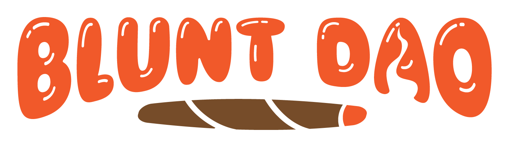

# BluntDAO App


**BluntDAO** is the biggest IRL onboarding movement to Web3 via Proof of Sesh through local IRL OGs. We are now introducing the unlimited sesh fund, a regular re-up mechanism where anyone can request ETH to host a sesh from contributors. Onboarding the next million, 1 blunt/sesh at a time.

## 🌿 What is BluntDAO?

BluntDAO is a decentralized autonomous organization (DAO) focused on onboarding people to Web3 through real-world social interactions called "Proof of Sesh." The concept involves physically meeting with existing DAO members, sharing a sesh (smoking session), and being onboarded into the Web3 ecosystem through this authentic human connection.

### Core Features:
- **Proof of Sesh**: IRL onboarding mechanism through physical meetups
- **Multi-chain Support**: Solana, NEAR, Polygon, and EVM chains
- **NFT Marketplace**: BluntDAO NFTs on multiple platforms
- **Community Dashboard**: Member management and social features
- **Unlimited Sesh Fund**: Community funding for events and meetups
- **Chapter System**: Local chapters worldwide

## 🚀 Live Application

- **Main Website**: [bluntdao.com](https://www.bluntdao.com/)
- **Marketplace**: [bluntdao.holaplex.market](https://bluntdao.holaplex.market/)
- **DAO Governance**: [nouns.build/dao/base/0x8a613Cb90Ab3b318D4e46D09F260a84b788e206b](https://nouns.build/dao/base/0x8a613Cb90Ab3b318D4e46D09F260a84b788e206b)

## 📱 App Structure

### Main Pages
- **Home** (`/`) - Landing page with banner, FAQ, gallery, and roadmap
- **Dashboard** (`/dashboard/*`) - Member dashboard with multiple sections
- **Proof of Sesh** (`/pos`) - Information about the onboarding process
- **Links** (`/links`) - Comprehensive link directory
- **Map** (`/map`) - Interactive cannabis legal status map with real-time data
- **Docs** (`/docs`) - Documentation and manifesto
- **Partner Form** (`/partner`) - Partnership application
- **Tokenomics** (`/tokenomics`) - Token economics information

### Dashboard Features
- **Overview** (`/dashboard/overview`) - Main dashboard with member stats
- **NFT Management** (`/dashboard/nft`) - View and manage NFTs
- **Feeds** (`/dashboard/feed`) - Social feeds and updates
- **Settings** (`/dashboard/settings`) - User preferences and configuration
- **Members** (`/dashboard/members`) - Member directory and management
- **AI Training** (`/dashboard/train-ai`) - AI model training interface


## 🛠 Technology Stack

### Core Dependencies
- **React** 17.0.2 - Frontend framework
- **TypeScript** 4.1.2 - Type safety
- **React Router DOM** 5.3.0 - Client-side routing
- **Web3Auth** 2.1.3 - Web3 authentication
- **Solana Web3.js** 1.50.1 - Solana blockchain integration
- **Metaplex** 0.14.0 - NFT marketplace integration
- **Leaflet** 1.9.4 - Interactive mapping library
- **React Leaflet** 4.2.1 - React wrapper for Leaflet maps

### Blockchain Integration
- **Solana**: Primary blockchain with NFT marketplace
- **NEAR**: 420 OG Validators on NEAR protocol
- **Polygon**: POAPs and soulbound NFTs
- **EVM Chains**: Base, Ethereum, and other EVM-compatible chains

### UI/UX Libraries
- **Material-UI** 4.12.3 - Component library
- **Styled Components** 5.3.1 - CSS-in-JS styling
- **React Slick** 0.29.0 - Carousel components
- **React Countdown** 2.3.2 - Countdown timers
- **React QR Code** 2.0.7 - QR code generation

### Development Tools
- **React Scripts** 5.0.1 - Build tooling
- **React App Rewired** 2.2.1 - Custom webpack configuration
- **Sass** 1.52.3 - CSS preprocessing
- **Webpack** 5.74.0 - Module bundler


## 🔗 Social Media & Community Links

### Primary Social Platforms
- **Twitter**: [@bluntdao](https://twitter.com/bluntdao)
- **Discord**: [discord.gg/e3cGSTzyWp](https://discord.gg/e3cGSTzyWp)
- **Telegram**: [t.me/+t2nnbUov1sRhMTgx](https://t.me/+t2nnbUov1sRhMTgx)
- **Instagram**: [@bluntdao](https://www.instagram.com/bluntdao/)
- **LinkedIn**: [BluntDAO Company](https://www.linkedin.com/company/bluntdao/)

### Content & Media
- **Medium**: [@bluntdao](http://medium.com/@bluntdao)
- **YouTube**: [BluntDAO Channel](https://www.youtube.com/channel/UCSWKFnP3z27XFu1CPRvqV6Q)
- **Reddit**: [r/BluntDAO](https://www.reddit.com/r/BluntDAO/)
- **Newsletter**: [subscribe.bluntdao.org](https://subscribe.bluntdao.org)

### NFT Marketplaces
- **Solana Marketplace**: [bluntdao.holaplex.market](https://bluntdao.holaplex.market/)
- **NEAR OG Validators**: [paras.id/token/bluntdao.snft.near::1](https://paras.id/token/bluntdao.snft.near::1)
- **OpenSea**: [opensea.io/BluntDAO](https://opensea.io/BluntDAO)

### DAO & Governance
- **Base DAO**: [nouns.build/dao/base/0x8a613Cb90Ab3b318D4e46D09F260a84b788e206b](https://nouns.build/dao/base/0x8a613Cb90Ab3b318D4e46D09F260a84b788e206b)
- **Solana DAO**: [app.sqds.io/nft/6NrbQwDSvvnkn4Yv82hVnpyLoKsriPV1D7NUXwMKMxAp](https://app.sqds.io/nft/6NrbQwDSvvnkn4Yv82hVnpyLoKsriPV1D7NUXwMKMxAp/)
- **NEAR DAO**: [app.astrodao.com/dao/blunt.sputnik-dao.near](https://app.astrodao.com/dao/blunt.sputnik-dao.near)
- **Snapshot**: [snapshot.org/#/bluntdao.eth](https://snapshot.org/#/bluntdao.eth)

### Community & Events
- **Eventbrite**: [bluntdao.eventbrite.com](http://bluntdao.eventbrite.com/)
- **Lu.ma Events**: [lu.ma/sesh](https://lu.ma/sesh)
- **Guild.xyz**: [guild.xyz/bluntdao](https://guild.xyz/bluntdao)
- **Warpcast**: [warpcast.com/~/channel/bluntdao](https://warpcast.com/~/channel/bluntdao)

### Development & Resources
- **GitHub**: [github.com/BluntDAO](https://github.com/BluntDAO/)
- **Documentation**: [docs.bluntdao.org](https://docs.bluntdao.org)
- **Figma Designs**: [Figma File](https://www.figma.com/file/iw9ePuP780GyXPnjgVQboZ/BLUNTDAO?node-id=897%3A1169&t=CFV3sf2ULrLklsYD-1)
- **Miro Flow**: [Miro Board](https://miro.com/app/board/uXjVP8Xe5zs=/)

## 🎨 Assets & Images

### Main Branding
- **Logo**: `/public/img/logo.png`
- **Banner**: `/public/img/banner.gif`
- **Animated Logo**: `/public/img/BluntAnimated.gif`

### Proof of Sesh Process Images
- **Roll Up**: `/public/img/roll-up.png`
- **Light/Burn**: `/public/img/burn.png`
- **Init**: `/public/img/init.png`
- **Create Wallet**: `/public/img/token.png`
- **Validation**: `/public/img/validation.png`
- **Request**: `/public/img/request.png`

### Built With Partners
Located in `/public/img/built-with/`:
- Solana, NEAR, Polygon, IPFS
- Metaplex, Holaplex, Paras
- Web3Auth, GenaDrop, Keypom
- And many more Web3 infrastructure partners

### Dashboard Images
Located in `/public/img/dashboard-imgs/`:
- Various dashboard interface images
- Member profile images
- NFT gallery images

## 🚀 Installation & Setup

### Prerequisites
- Node.js (v22 or higher)
- Yarn package manager
- Git

### Installation Steps

1. **Clone the repository**
   ```bash
   git clone https://github.com/BluntDAO/bluntdao-app.git
   cd bluntdao-app
   ```

2. **Install dependencies**
   ```bash
   yarn install
   ```

3. **Environment Configuration**
   - Create a `.env` file in the root directory
   - Add your environment variables:
     ```env
     REACT_APP_VERCEL_ENV_WEB3AUTH_CLIENT_ID=your_web3auth_client_id
     REACT_APP_SOLANA_RPC_URL=your_solana_rpc_url
     REACT_APP_NEAR_RPC_URL=your_near_rpc_url
     ```

4. **Start development server**
   ```bash
   yarn start
   ```

5. **Build for production**
   ```bash
   yarn build
   ```

## 🏗 Project Structure

```
bluntdao-app/
├── public/                 # Static assets
│   ├── img/               # Images and graphics
│   ├── icons/             # SVG icons
│   └── index.html         # HTML template
├── src/
│   ├── component/         # Reusable components
│   │   ├── Banner/        # Hero banner
│   │   ├── Dashboard*/    # Dashboard components
│   │   ├── Footer/        # Footer component
│   │   ├── Gallery/       # NFT gallery
│   │   ├── Navbar/        # Navigation
│   │   ├── ProofOfSesh/   # POS process
│   │   └── ...
│   ├── Pages/             # Page components
│   │   ├── Dashboard/     # Dashboard pages
│   │   ├── Home.tsx       # Landing page
│   │   ├── Links/         # Links page
│   │   └── ...
│   ├── gen-state/         # Global state management
│   ├── utils/             # Utility functions
│   ├── styles/            # Global styles
│   └── App.tsx            # Main app component
├── package.json           # Dependencies
├── tsconfig.json          # TypeScript config
└── README.md              # This file
```

## 🔧 Configuration

### Web3Auth Setup
The app uses Web3Auth for social login integration. Configure your client ID in the environment variables.

### Solana Configuration
- RPC endpoint configuration
- Wallet adapter setup
- Metaplex integration

### Multi-chain Support
- Solana: Primary blockchain
- NEAR: OG Validators
- Polygon: POAPs and soulbound NFTs
- EVM chains: Base, Ethereum

## 📊 Features Overview

### Proof of Sesh Process
1. **Roll Up A Blunt** - Find people to sesh with
2. **Light Blunt** - Light and hit the sesh device
3. **Init** - Initialize rotations and pass to new members
4. **Create Wallet** - Download wallet and join community
5. **Validation** - Send address and claim NFT
6. **Onboard Others** - Continue the cycle

### Dashboard Features
- Member management
- NFT viewing and management
- Social feeds
- AI training interface
- Settings and preferences

### Community Features
- Chapter system
- Event management
- Partnership applications
- Volunteer coordination

### Interactive Cannabis Legal Map Features
- **Real-time Legal Status**: Current cannabis laws for all 50 US states
- **Color-coded Visualization**: Easy-to-understand status indicators
- **Advanced Filtering**: Search by legal status, medical/recreational, state name
- **Detailed State Information**: Penalties, laws, dispensary counts, major businesses
- **Mobile Responsive**: Optimized for all devices and screen sizes
- **SEO Optimized**: Structured data and meta tags for search engines
- **Authoritative Sources**: Links to official legal resources and documentation
- **Interactive Features**: Click states for detailed information panels

## 🔍 SEO Optimization & Performance

### Current SEO Implementation

#### ✅ **Completed Optimizations**
- **Structured Data**: JSON-LD schema markup on all major pages
- **Meta Tags**: Comprehensive Open Graph and Twitter Card meta tags
- **Sitemap**: Complete XML sitemap with all country/state pages (`/sitemap.xml`)
- **Robots.txt**: Search engine crawling guidance (`/robots.txt`)
- **Performance**: Lazy loading, code splitting, and resource preloading
- **Mobile Optimization**: Responsive design across all devices
- **Page Speed**: Optimized images, fonts, and critical resource loading

#### 🎯 **SEO-Optimized Pages**
- **Home Page** (`/`) - Organization schema, comprehensive meta tags
- **Cannabis Map** (`/map`) - WebApplication schema, real-time legal data
- **Country Pages** (`/map/:country`) - Article schema, location-specific content
- **State Pages** (`/map/:country/:state`) - Detailed legal information
- **Proof of Sesh** (`/pos`) - Service schema, verification system info
- **Brand Guidelines** (`/brand`) - Creative work schema, brand assets

### 📈 **SEO Performance Metrics**

#### **Target Keywords**
- Primary: "BluntDAO", "cannabis community", "Web3 onboarding"
- Secondary: "proof of sesh", "cannabis legal status", "global cannabis map"
- Long-tail: "cannabis laws by country", "marijuana legalization map", "Web3 cannabis DAO"

#### **Content Coverage**
- **13+ Countries** with dedicated legal status pages
- **50+ US States** with comprehensive cannabis law information
- **15+ BluntDAO Chapters** with local community information
- **1000+ Cannabis Dispensaries** tracked across legal regions

### 🚀 **Recommended SEO Improvements**

#### **High Priority (Immediate)**
1. **Image Optimization**
   ```bash
   # Convert images to WebP format for better compression
   # Add proper alt text to all images
   # Implement responsive image loading with srcset
   ```

2. **Core Web Vitals**
   ```javascript
   // Implement Intersection Observer for lazy loading
   // Optimize Largest Contentful Paint (LCP)
   // Reduce Cumulative Layout Shift (CLS)
   // Improve First Input Delay (FID)
   ```

3. **Internal Linking Strategy**
   ```markdown
   - Add contextual links between related cannabis law pages
   - Create topic clusters around cannabis legalization
   - Implement breadcrumb navigation site-wide
   - Add "Related Articles" sections to country pages
   ```

#### **Medium Priority (Next Sprint)**
1. **Content Expansion**
   ```markdown
   - Add cannabis culture sections to country pages
   - Create comprehensive FAQ pages for each legal status
   - Develop cannabis industry analysis content
   - Add historical timeline of cannabis legalization
   ```

2. **Technical SEO**
   ```javascript
   // Implement proper canonical URLs
   // Add hreflang tags for international content
   // Create XML sitemaps for different content types
   // Optimize URL structure for better crawling
   ```

3. **Local SEO**
   ```markdown
   - Create location-specific landing pages for BluntDAO chapters
   - Add Google My Business listings for physical locations
   - Implement local business schema markup
   - Create city-specific cannabis law pages
   ```

#### **Long-term (Future Releases)**
1. **Advanced Features**
   ```javascript
   // Implement AMP pages for mobile performance
   // Add Progressive Web App (PWA) capabilities
   // Create API documentation with schema markup
   // Develop cannabis news and blog section
   ```

2. **Analytics & Monitoring**
   ```bash
   # Set up Google Search Console monitoring
   # Implement comprehensive analytics tracking
   # Create SEO performance dashboards
   # Monitor cannabis law changes for content updates
   ```

### 📊 **SEO Tools & Monitoring**

#### **Recommended Tools**
- **Google Search Console**: Monitor search performance and indexing
- **Google Analytics 4**: Track user behavior and conversion goals
- **Screaming Frog**: Technical SEO auditing and crawling
- **Ahrefs/SEMrush**: Keyword research and competitor analysis
- **PageSpeed Insights**: Core Web Vitals monitoring

#### **Key Metrics to Track**
- Organic search traffic growth
- Cannabis-related keyword rankings
- Page load speed and Core Web Vitals
- Mobile usability scores
- Local search visibility for BluntDAO chapters

### 🎯 **Content Strategy Recommendations**

#### **Cannabis Legal Content**
```markdown
1. **Weekly Legal Updates**
   - Track cannabis law changes globally
   - Update country/state pages with new legislation
   - Create news articles about legalization progress

2. **Educational Content**
   - Cannabis 101 guides for beginners
   - Web3 onboarding tutorials
   - Proof of Sesh explanation videos

3. **Community Content**
   - BluntDAO chapter spotlights
   - Member success stories
   - Event coverage and recaps
```

#### **Technical Content**
```markdown
1. **Developer Resources**
   - API documentation for cannabis data
   - Integration guides for Web3 features
   - Open source contribution guidelines

2. **Industry Analysis**
   - Cannabis market reports
   - Blockchain adoption in cannabis industry
   - DAO governance case studies
```

### 🔧 **Implementation Checklist**

#### **Phase 1: Foundation (Week 1-2)**
- [ ] Audit all images and add proper alt text
- [ ] Implement WebP image format conversion
- [ ] Add structured data to remaining pages
- [ ] Optimize Core Web Vitals scores
- [ ] Set up Google Search Console

#### **Phase 2: Content (Week 3-4)**
- [ ] Expand country page content with culture sections
- [ ] Create comprehensive FAQ pages
- [ ] Implement internal linking strategy
- [ ] Add breadcrumb navigation

#### **Phase 3: Advanced (Week 5-6)**
- [ ] Implement local SEO for BluntDAO chapters
- [ ] Create cannabis industry analysis content
- [ ] Set up automated sitemap generation
- [ ] Implement advanced analytics tracking

### 📱 **Mobile SEO Priorities**
- Optimize mobile page speed (target <3 seconds)
- Implement touch-friendly navigation
- Ensure proper mobile viewport configuration
- Test cannabis map functionality on mobile devices
- Optimize form submissions for mobile users

---

## 🤝 Contributing

1. Fork the repository
2. Create a feature branch (`git checkout -b feature/amazing-feature`)
3. Commit your changes (`git commit -m 'Add amazing feature'`)
4. Push to the branch (`git push origin feature/amazing-feature`)
5. Open a Pull Request

## 📄 License

This project is licensed under the MIT License - see the [LICENSE](LICENSE) file for details.

## 🙏 Acknowledgments

- Built on the [Metaplex](https://github.com/metaplex-foundation/metaplex) foundation
- Originally based on [candymachine-v2-boiler-mint-site-noFLP](https://github.com/tonyboylehub/candymachine-v2-boiler-mint-site-noFLP)
- Special thanks to all BluntDAO community members and contributors

## 📞 Contact & Support

- **Email**: bluntdao@protonmail.com
- **Discord**: [Join our Discord](https://discord.gg/e3cGSTzyWp)
- **Telegram**: [Join our Telegram](https://t.me/+t2nnbUov1sRhMTgx)
- **Website**: [bluntdao.com](https://www.bluntdao.com/)

---

**BluntDAO** - Onboarding the next million, 1 blunt/sesh at a time. 🌿




